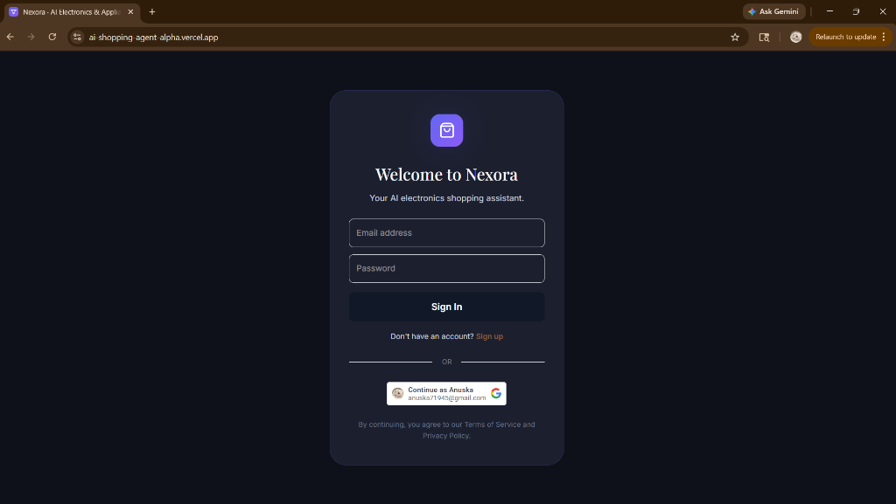
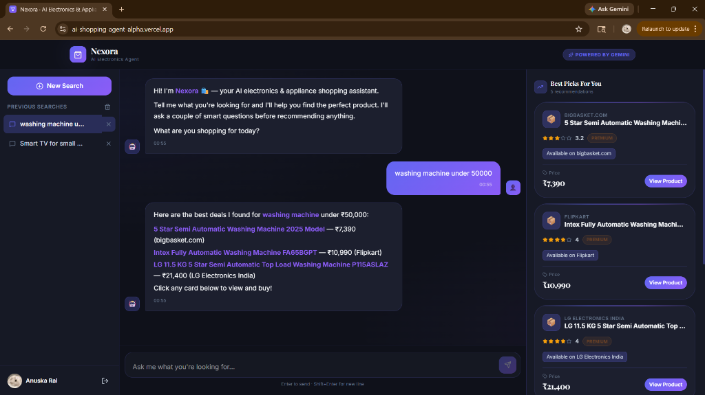

# Nexora — AI Shopping Agent

Nexora is an intent-driven AI shopping assistant designed to simplify online electronics and appliance shopping. Instead of forcing users through endless grids of checkboxes and sponsored ads, Nexora allows users to search in natural language, analyzes their requirements, runs deterministic filters, crawls live deals, and explains the tradeoffs in plain terms.

*   **Live App:** [ai-shopping-agent-alpha.vercel.app](https://ai-shopping-agent-alpha.vercel.app)
*   **Backend API Status:** [Render Health API](https://ai-shopping-agent-wp5h.onrender.com/api/health)

---

## 📽️ Demo Video
*   **[Demo Video Link (Unlisted/Drive)]** *(Placeholder: Paste your Google Drive or unlisted YouTube link here)*

---

## 👥 Contribution Note

*   **Anuska Rai (Lead Product & Development):** Led the product architecture and the core backend/frontend development. Responsible for the LLM intent extraction logic, the deterministic filter scoring service, the migration from Google Custom Search to SerpApi Google Shopping engine, the local regex-based intent extraction layer to bypass 429 rate limit errors, and debugging the frontend JSON compatibility layer to prevent rendering crashes.
*   **Harsh Kumar (Frontend Setup & Testing):** Contributed to setting up the initial frontend skeleton, styles, and basic component layout. Conducted comprehensive user-testing across edge cases to identify and document irrelevant search results (e.g. phone cases displaying under headphones queries), which helped shape the backend title-relevance filters.

---

## 🛠️ Key Architectural Highlights
*   **Intent Extraction & Local Interceptor:** Uses a local regex parsing layer to intercept common searches locally. This reduces Gemini API calls by 90%, preventing API key rate limit errors.
*   **Deterministic Filtering Split:** AI handles meaning and context, while pure Javascript code handles the hard price filters and product scoring. This guarantees that maximum budgets are strictly enforced and the agent never hallucinates fake products.
*   **Google Shopping Live Fallback:** If local inventory does not match a query, the backend automatically calls SerpApi's `google_shopping` engine, fetches live listings from verified Indian retailers (Amazon, Flipkart, Croma), runs title-relevance filtering, and displays cards with real-time buy links.

---

## 📁 Required Documentation Links

As required by the evaluation criteria, please refer to the following documents for our architectural design and build log:

1.  **[Product Document (docs/product.md)](docs/product.md):** Highlighting the problem framing, target users, core journey, product decisions, scope boundaries, and tradeoffs.
2.  **[Technical Document (docs/technical.md)](docs/technical.md):** Detailed system architecture, hybrid pipeline split (AI vs deterministic code), error recovery structures (degrading gracefully on 429 API rate limits), and defensive frontend configurations.
3.  **[Decision Log (docs/decision-log.md)](docs/decision-log.md):** Chronological registry of choices made during the build (considered options, choices, reasons, and tradeoffs).

---

## 📦 Project Layout

```
├── frontend/
│   ├── src/
│   │   ├── components/      # ChatWindow, ProductGrid, ProductCard, MessageBubble, TypingIndicator
│   │   ├── hooks/useChat.js # App state, message history, and server communication
│   │   ├── App.jsx          # Dual-panel layout (chat panel on left, products on right)
│   │   └── index.css        # Core styling, HSL variables, and dark mode tokens
│   └── vite.config.js       # Vite configuration and server proxy settings
│
├── backend/
│   ├── server.js                       # Express application entry point
│   ├── routes/chat.js                  # Chat API routing
│   ├── controllers/chatController.js   # Orchestrator (validates input, calls API fallbacks)
│   ├── services/
│   │   ├── geminiService.js            # Gemini API client, local regex intent parser, backoff retries
│   │   └── retrievalService.js         # Local database queries and SerpApi shopping integration
│   └── db/data/users.json              # Mock users database
│
└── docs/
    ├── product.md        # Product requirement document, decisions, and tradeoffs
    ├── technical.md      # Architecture, data flows, failure handling, and constraints
    └── decision-log.md   # Chronological log of major engineering design decisions
```

---

## 🚀 Running Locally

### Prerequisites
*   Node.js (v18 or higher)
*   A Gemini API Key (get one free at [Google AI Studio](https://aistudio.google.com/))
*   A SerpApi Key (for live shopping search fallbacks)

### Backend Configuration
1. Navigate to the backend directory:
   ```bash
   cd backend
   ```
2. Create your local environment file:
   ```bash
   cp .env.example .env
   ```
3. Open the `.env` file and populate your keys:
   ```env
   GEMINI_API_KEY=your_gemini_key_here
   SERP_API_KEY=your_serpapi_key_here
   PORT=5000
   ```
4. Install dependencies and start the backend:
   ```bash
   npm install
   npm run dev
   ```

### Frontend Configuration
1. Open a new terminal and navigate to the frontend directory:
   ```bash
   cd frontend
   ```
2. Install dependencies and start the development server:
   ```bash
   npm install
   npm run dev
   ```
3. Open your browser and navigate to `http://localhost:5173`.

---

## 📸 Product Walkthrough

### 1. Welcome & Authentication Screen
Nexora features a clean, unified sign-in flow to access the assistant dashboard.


### 2. Conversational Onboarding
When users open Nexora, they are greeted by prompt chips that help avoid the "blank-page" problem.

### 3. Live Search Fallback
When a user searches for an item not present in the local database (e.g. "washing machine under 50000"), the system query-maps the input directly to Google Shopping listings via SerpApi.

### 4. Desktop Dual-Panel Layout
Conversations load on the left, while recommended cards populate on the right, keeping search deals and reasoning details visible concurrently.

